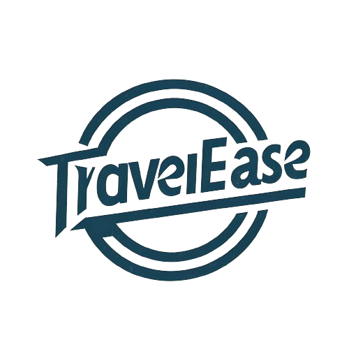
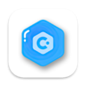
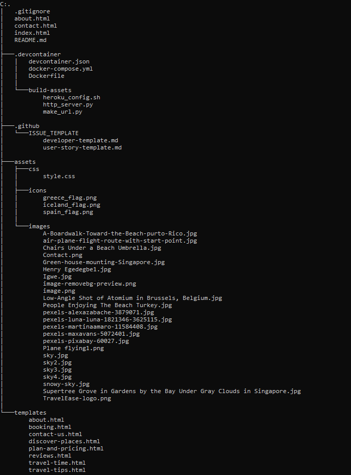

<a name="readme-top"></a>

<!--
*** Thank you for checking out and/or using this project. If you have a suggestion
*** that would make this better, please fork the repo and create a pull request
*** or simply open an issue with the tag "improvement".
*** Don't forget to give the project a star!
-->

<!-- PROJECT LOGO -->
<br />
<div>
  <a href="https://scientistigwe.github.io/TravelEase-Website/">
    
</a>
<br>
<a href="https://codeinstitute.net/?nab=0">
    </a>
  </div>
  <br>
  <br>
  <br>

  <h1 align="center">TravelEase</h1>

  <p align="center">
This documentation is a detailed step by step breakdown of the planning, design, development, testing & validation, and deployment of TravelEase Website.
    <br />
    <br />
    <a href="https://github.com/scientistigwe/TravelEase-Website/blob/main/README.md"><strong>Explore the docs »</strong></a>
    <br />
    <br />

<!-- TABLE OF CONTENTS -->

Table of Contents

<!-- INTRODUCTION SECTION -->

  <details>
  <summary><a href="#introduction">SECTION 1: INTRODUCTION</a></summary>
        <li><a href="#about-the-project">About The Project</a>
        <li><a href='#user-stories'>User Stories</a></li>
        <li><a href="#technology-stack">Technology Stack</a></li>
        <li><a href="#languages-frameworks-libraries">Languages, Frameworks and Libraries</a></li>
        <li><a href="#management-and-development">Project Management and Development Approach</a></li>
    </details>
    <!-- PROJECT SETUP SECTION -->
    <details>
    <summary><a href="#project-setup">SECTION 2: PROJECT SETUP</a>
</summary>
        <li><a href="#prerequisites">Prerequisites</a></li>
        <li><a href="#installation">Installation</a></li>
    </details>
    <details>
    <summary><a href="#features-and-structure">SECTION 3: PROJECT FEATURES AND STRUCTURE</summary>
    <li><a href="#features">Features</a></li>
        <li><a href="#structure-and-navigation">Structure and Navigation</a></li>
        <li><a href="#wireframes">Wireframes</a></li>
         <li><a href="#design-and-styling">Design and Styling</a>
        <ol>
            <li><a href="#design">Design</a></li>
            <li><a href="#color">Color</a></li>
            <li><a href="#font">font</a></li>
            <li><a href="#media">media</a></li>
        </ol>
        </li>
</details>
<details>
<summary><a href="#testing-and-validation">SECTION 4: TESTING AND VALIDATION</a>
</summary>
    <li><a href="#testing">Testing</a></li>
        <li><a href="#validation">Validation</a>
        <ol>
        <li><a href="#html-validator-report">HTML Validator Report</a></li>
        <li><a href="#css-validator-report">CSS Validator Report</a></li>
        </ol>
        </li>
        <li><a href="#user-story-testing">User Story Testing</a></li>
        <li><a href="#bugs-and-issues">Bugs and Issues</a></li>
</details>
<details>
<summary><a href="#deployment-and-credits">SECTION 5: DEPLOYMENT AND CREDITS</a>
</summary>
        <li><a href="#final-product">Final Product</a></li>
        <li>
            <a href="#credits">Credits</a>
            <ol>
                <li><a href="#template">Template</a></li>
                <li><a href="#content">Content</a></li>
                <li><a href="#media2">Media</a></li>
            </ol>
        </li>
<li><a href="#acknowledgments">Acknowledgments</a></li>
<li><a href="#contact">Contact</a></li>
</details>

<!-- INTRODUCTION -->

#

<section>
<h1 id="introduction">SECTION 1: INTRODUCTION </h1>

This section contains summary information about the project, the user expections and tools used in building this solution.

<h2 id="about-the-project">About The Project</h2>

<p align="center"><a href="https://scientistigwe.github.io/TravelEase-Website/">TravelEase Homepage</a></p>

<a href="https://github.com/scientistigwe/README-Template">

</a>
<br>
<br>

TravelEase is a one-stop solution for adventurers, explorers and lovers of nature. It was painstakely designed to do all the hardstuff and erase all gray areas around tourism planning and implementation. We do this so that you can do more fun things.

Some of the unique features of this project are:

- User friendly landing page.
- Clear navigation items and call to action buttons at strategic locations
- Ai-powered travel planner and up-to-date travel time.
- A gallery of hot tourist destination sites to keep users busy and desiring.

Click the link to explore the site: [TravelEase Website](https://scientistigwe.github.io/TravelEase -Website/)

<h2 id="user-stories">User Stories</h2>

- As a new user of this website, I want to easily navigate my way around the websites with clickable buttons to desired pages.
- As a new user of this website, I want to see top holiday destination areas, so that I can easily decide where to visit.
- As a user, I want to access the Plan and Pricing page easily, so that I can make informed decisions.
- As a user, I want to access the Plan and Pricing page easily, so that I can make informed decisions.
- As a user, I want the Plan and Pricing page to look simple and rich with clarity on each plan and the associated pricing, so that I can compare my options.
- As a user, I want to access the Booking page easily, so that I can make a booking.
- As a user, I want to seamlessly get travel information about my selected destination, so that I can be up-to-date on upcoming trip.
- As a user, I want to see the social media handles, so that I can follow TravelEase on social media.
- As a user, I will like to have a chatbot in the homepage that will answer some questions and help in travel planning/budgeting.

<h2 id="technology-stack">Technology Stack</h2>

This subsection outlines the technologies, frameworks, libraries, and tools used in the development of this project. It provides insight into the foundational components that powers TravelEase.

<h2 id="languages-frameworks-libraries">Languages, Frameworks and Libraries</h2>

- <a href="https://en.wikipedia.org/wiki/HTML5"> HTML5</a> - Used for designing the structure of the project.

- <a href="https://en.wikipedia.org/wiki/CSS"> CSS3</a> - Used for styling the project.

- <a href="https://fonts.google.com/"> Google Fonts</a> - Provides all of the fonts for this website.

- <a href="https://fontawesome.com/"> Font Awesome</a> - Used for the site icons.

- <a href="https://github.com/IrisSmok"> Github</a> - Used to store the project code.

- <a href="https://www.gitpod.io/"> Gitpod</a> - An IDE Used for coding.

- <a href="https://balsamiq.com/"> Balsamiq</a> - Used to create site wireframes.

- <a href="https://www.shutterstock.com/home"> Shutterstock</a> and <a href="https://unsplash.com/"> Unsplash photo</a> - Used for all images on the website.

- <a href="https://google-map-generator.com/"> Google Map Generator</a> - Used to import business location.

- <a href="http://ami.responsivedesign.is/"> Am I Responsive</a> - Used to check if the site is responsive on different screen sizes.

- <a href="https://www.img2go.com/compress-image#j=f26cc008-23b4-4d4e-9934-96877fa9a7e7"> IMG2GO</a> and <a href="https://tinypng.com/"> Tiny PNG</a> - Used to help compress the images.

- <a href="https://www.freeformatter.com/html-formatter.html"> Free Online HTML Formatter</a> - Used to correct indentation issues and get rid of excess whitespace.

- <a href="https://getbootstrap.com/"> Bootstrap</a> - Used for building responsive and mobile-first websites and web applications.

- <a href="https://chromewebstore.google.com/detail/lighthouse/blipmdconlkpinefehnmjammfjpmpbjk"> Google Lighthouse</a> - A free Google tool that helps you improve the quality of webpages on your website.

The tool audits your pages for performance, accessibility, SEO, and more. And offers suggestions so you can improve these aspects..

<h2 id="management-and-development">Project Management and Development Approach</h2>

This project was implemented using the Agile Manifesto methodology. Below are the ways this project adhered to the 4 core values and 12 core principles of the aforementioned method:

<strong>Four Values of the Agile Manifesto:</strong>

- Vision 1: Customer collaboration over contract negotiation: The Team held **16** Hurdles through Slack Platform, ensuring alignment with user needs and prioritizing features through user story mapping.

<p align="center"><strong>A screenshot of a one of the team's huddles through slack.</strong></p>

<br>
<br>

- Vision 2: Responding to change over following a plan: Throughout the project, the team managed
  [](https://github.com/scientistigwe/TravelEase-Website/issues) + [](https://github.com/scientistigwe/TravelEase-Website/issues) GitHub issues, adapting to changing requirements and feedback iteratively.

- Vision 3: Working software over comprehensive documentation: We achieved **26 story points** across **1 sprint**, emphasizing the focus on delivering functional software increments.
<p align="center"><strong>A screenshot of Kanban Board.</strong></p>

<br>
<br>

- Vision 4: Individuals and interactions over processes and tools: Daily interactions on GitHub led to **89 commits**, fostering collaboration and knowledge sharing among team members.

<p align="center"><strong>A screenshot of Github activities ilustrating collaborative environment.</strong></p>

<br>
<br>

<strong>Twelve Principles of the Agile Manifesto</strong>

- Satisfy the customer: Held regular meetings to ensure alignment with user stories.
- Deliver working software: Prioritized delivering functional increments in each sprint, allowing for early feedback.
- Welcome changing requirements: Maintained open communication channels and adapted plans iteratively.
- Collaborate daily: Conducted daily standup, catchup and stand-down to facilitate collaboration and problem-solving.
- Face-to-face conversation: Utilized over 15 virtual meetings through slack huddle to enhance clarity and understanding.
- Motivated individuals: Empowered team members through skill development and recognition.
- Measure progress through working product: Evaluated progress based on delivered functionality in each sprint.
- Promote sustainable development: Prioritized sustainability practices to ensure long-term success.
- Simplicity is essential: Used MoSCoW prioritization and focused on MVP delivery to avoid unnecessary complexity.
- Continuous attention to technical excellence: Adopted show and tell technique to ensure all team members learn while collaborating.
- Self-organizing team: Encouraged autonomy and collaboration within the team.
- Regular reflection on continuous improvement: Conducted regular retrospectives to identify areas for improvement.

<p align="right">(<a href="#readme-top">back to top</a>)</p>

<!-- PROJECT SETUP -->

#

<h1 id="project-setup">SECTION 2: PROJECT SETUP</h1>

In this section, a detailed account of all requirements needed for TravelEase to be setup and running. It also includes installation instructions and a link to all necessary documentations for these tools.

<h2 id="prerequisites">Prerequisites</h2>

TravelEase does not rely on any external dependencies or services.

<h2 id="installation">Installation</h2>

_Below is a guide on how you can clone and adopt this project._

<p align="center">Clone the repo:</p>
   ```sh
   git clone https://github.com/scientistigwe/TravelEase-Website.git
   ```

<p align="right">(<a href="#readme-top">back to top</a>)</p>

#

<h1 id="features-and-structure">SECTION 3: PROJECT FEATURES AND STRUCTURE</h1>

This section encompasses the various elements and functionalities aimed at enhancing the user experience and achieving the goals of the TravelEase website. It outlines the key features and structural components intended to provide visitors with a seamless and informative journey through the platform.

<h1 id="features">Features</h1>

The key features are:

- <strong>Navigation:</strong> Designed to facilitate users effortless access to different sections and pages.
- <strong>Discover Places:</strong> Provides comprehensive information about the the 3 key destination categories -Mountain side & Nature's beauty; Ocean view & Beaches, and Snowy & Countryside.
- <strong>Plan and Pricing:</strong> Provides corresponding plans and prices of each plan. The 3 plans offered by TravelEase are standard, gold and platinum.
- <strong>Reviews:</strong> Showcases testimonials and highlights positive experiences from previous clients, fostering trust and credibility among potential customers.
- <strong>Travel Tips and Updates:</strong> Presents a tabular representation of travel tips and latest updates, serving as a source of inspiration for clients.
- <strong>Contact Us Form:</strong> Offers a user-friendly contact form that simplifies the process of reaching out to the team. This will empower clients to submit inquiries or provide feedback seamlessly.
- <strong>The Team:</strong> Displays essential contact details of the team members prominently on the website, ensuring users can easily reach out to the establishment via phone, email, or physical address.
- <strong>Social Links:</strong> Includes links to the company's social media profiles, enabling users to stay connected and updated with the latest news, promotions, and announcements.
- <strong>Responsive Design:</strong> Ensures that the website is accessible and functional across various devices and screen sizes, providing a consistent user experience.
- <strong>Interactive Elements:</strong> Incorporates interactive elements such as buttons, sliders, and hover effects to enhance user engagement and interactivity, making the browsing experience more enjoyable and intuitive.

- Other features to be implemented in the future include:

- <strong>Carousel button slider:</strong> A slider with a javascript listener that will capture a button click and update the carousel accordingly.

- <strong>ChatBot:</strong>: An AI-powered self service system that will guide and direct clients based on their specific needs.

<h2 id="structure-and-navigation">Structure and Navigation</h2>

- **File Organisation**

  - The files where structured into folders and clustered based on functionality. Also file naming convention that reflects the functions of the content was adopted.

- **Header**

  - TravelEase logo positioned left
  - Appears on every page

- **Nav bar**

  - Appers on every page
  - Navigation bar on the right

- **Menu items**

  - Appers on every page
  - Directs users to specific page

- **Footer**

  - Includes links to all social media platforms through the use of icons and text.
  - Appears on every page

- **Home Page**
  - _Background Image_ - appears on every page and spans accros the full viewport of everydevice. It has the touch of skyblue colour which illustrates calmness and serenity.
  - _Hero details_ - appears at the top-center of the home page, below the header section and intuitive enough to catch a user's attention.
  - _Testimonials_ - just below the hero image section, responsively arranged to maximize various device screen width and give users a good experience.
  - _Call to action buttons_ - provides an easy portal to booking and other pages.
- _Plan and Pricing_ - has a dedicated page with a navigation link on the navbar of every page.
- _Meet the Team_ - Meet the Team is the 4th section in the homepage with a flip-like property which when hovered-over, reveals the details of each team member and a hyper reference link to their profile attached to each of their names.

<h2 id="wireframes">Wireframes</h2>

### _File Organisation Tree_

<p align="center">

</p>

### _Home Page_

<p align="center">

</p>

### _Mobile View - Home Page_

<p align="center">

</p>

<h2 id="design-and-styling">Design and Styling</h2>

<h3 id="design">Design</h3>

Given the serene ambiance of the establishment, the website echoes this sentiment through its design. Employing a predominantly skyblue background conveys cleanliness, brightness, and sterility—attributes associated with a such setting.

<h3 id="color">Color</h3>

- **Background - Skyblue Image (#87CEEB)**: This color was selected because it conveys a sense of tranquility and openness, aligning with the theme of travel and exploration. The light blue hue evokes feelings of calmness and serenity, which are often associated with leisure and vacation.

- **Navigation menu items - Light Gray (#f5f5f5)**: Light gray provides a neutral and calming backdrop for the content, ensuring readability and visual comfort for users.

- **h1 - h6, p - Black (#000000)** - Black text on an off-white text background offers high contrast against the skyblue background, ensuring readability and accessibility for users
- **footer - [default]** - we have kept most of our text the same default black colour because it matches well with the rest of the site, providing a solid contrast with the background, and causing no issues.

<h3 id="font">Font</h3>

- main font: Montserrat - We have chosen Montserrat because it is a font-style that is widely available within most, if not all, browsers and the font maintains a professional style.
- Secondary font - sans-serif

<h3 id="media">Media</h3>

**Background image** - a mix of an iceberg / sky background that features lighter colours. Lighter colours are generally viewed as more positive, and we want our customers to associate our site with positivity, whether that be through colours or otherwise.

**Contact section** - Our contact button is simply located in the top left of our page to ensure that it is abundantly clear to our customers that we are easy to contact. The page itself is currently work in progress.

**Plans and Pricing** - This is one of the menu items located second from right. It has a link pointing to plans and ricing page.

<p align="right">(<a href="#readme-top">back to top</a>)</p>

#

<h1 id="testing-and-validation">SECTION 4: TESTING AND VALIDATION</h1>
- In this section, the functionalities of the final product was tested and validated to ensure consistency with user stories.
<h2 id="testing">Testing</h2>

- **Browser Compatibility Testing:** Ensured compatibility with Chrome, Opera, Microsoft Edge, and Firefox desktop browsers.

- **Responsiveness Testing:** Utilized Chrome Developer Tools to verify responsiveness across multiple devices: Desktop, Laptop, Moto G4, Galaxy S5, iPhone 5/SE, iPhone 6/7/8, iPhone 6/7/8 Plus, iPad, iPad Pro, Galaxy Fold

<h2 id="validation">Validation</h2>

The W3C Markup Validator and W3C CSS Validator Services were used to check my code for syntax errors in this project.

- [HTML W3C Validator](https://validator.w3.org/#validate_by_input): I checked each page by direct input method on HTML validator site.

<p align="center">

</p>

- [CSS W3C Validator](https://jigsaw.w3.org/css-validator/): I checked each page by direct input method on HTML validator site. No error or warning message was encountered following this test.

<p align="center">

</p>

- [Google Lighthouse](https://pagespeed.web.dev/analysis/https-scientistigwe-github-io-TravelEase-Website/83eeb3j0mi?hl=en-GB&form_factor=desktop): I used Google Lighthouse Dev Tool to test the website's performance, accessibility, best practices and SEO on both mobile and desktop devices.
<p align="center">

</p>

<h3 id="html-validator-report">HTML Validator Report</h3>

- The error and warning messages were corrected and re-tested to ensure full compartibility with HTML best practices. Some of the errors and warning meassages were:

- _Warning_ : Section lacks heading (from line 32, column 9 of index.html)

- _Value Error_ Stray end tag - div (from line 258, column 13 of index.html)

<h3 id="css-validator-report">CSS Validator Report</h3>

- No error or warning message was encountered following this test.

<h2 id="user-story-testing">User Story Testing</h2>

- Reviews Section Carousel #7 "As a user, I want a carousel with controls, and a review cards containing sample text."

  - We created a page called reviews.html and included a link to it at the navigation bar with a hover effect to make it visible to the user. Also, a card was used to display the it in section 1 of the homepage with a call to action button to the page.

  <p align="center">
  
  </p>

- Booking #17: "As a user, I want to access the Booking page easily, so that I can make a booking."

  - We created a page called booking.html, and made the booking button visible at the top of the page. We also added multiple CTA buttons to make booking even easier.

  <p align="center">
  
  </p>

- Creation of "Discover Places" page #23: As a user, I want to see a dedicated page for popular places and contents with action button to get details.

  - We created a page called discover-places.html and included a link to it at the navigation bar with a hover effect to make it visible to the user. Also, a card was used to display the 3 key destinations in section 2 of the homepage with a call to action button to each category.

  <p align="center">
  
  </p>

- Creation of Contact us page #72: As a user, I want to see a page where I can reach out to the team for further information.

  - We created a page called contact-us.html and included a link to it at the navigation bar with a hover effect to make it visible to the user.

    <p align="center">
    
    </p>
  <h2 id="bugs-and-issues">Bugs and Issues</h2>

- Ensuring Quality in Software Development #36: As a developer, I want to ensure that my code meets the highest standards of quality and reliability, so that I can deliver robust and error-free software to our users.

  - We encountered a broken link in the homepage after deployment. This issue was traced and amended.

<p align="right">(<a href="#readme-top">back to top</a>)</p>

#

<h2 id="deployment-and-credits">SECTION 5: DEPLOYMENT AND CREDITS</h2>

-In this section, the tested and validated product will be deployed and external resources used during this exercise will be mentioned.

<h2 id="final-product">Final Product</h2>

- The product is live and can be seen on **(https://scientistigwe.github.io/TravelEase-Website/index.html)**

### _Home Page_

<p align="center">

</p>

### _Plans and Pricing Page_

<p align="center">

</p>

<h2 id="credits">Credits</h2>

<h3 id="presentation">Presentation Slide</h3>

- This project was presented to a panel that was setup to review and grade this exercise. You can fine the presentation slide here: <a href="https://docs.google.com/presentation/d/1VB4rNATcFjUzOhr4vrWtI8Br0EcfGZNUBZ1DhYY5Bzk/edit?usp=sharing" alt="Google drive link to presentation slide" target="_blank">Presentation Slide</a>

<h3 id="template">README Template</h3>

- This readme template was adopted and adapted from README.md templates published by <a href="https://github.com/scientistigwe/README-Template" alt="Github page of Chibueze C. Igwe" target="_blank">Chibueze C. Igwe</a>, <a href="https://github.com/Iris-Smok/Vannas-Beauty-Salon_PP1" alt="Github page of Iris Smok" target="_blank">Iris Smok</a> and <a href="https://github.com/othneildrew/Best-README-Template" alt="Github page of Othneil Drew" target="_blank">Othneil Drew</a>.

<h3 id="content">Content</h3>

- All content was written by [Chibueze C. Igwe, Henry Egedegbe and Andy Ancans]

<!-- ACKNOWLEDGMENTS -->
<h2 id="acknowledgments">Acknowledgments</h2>

Use this space to list individuals, groups or resources you find helpful and would like to give credit to. I've included a few of my favorites to kick things off!

- [GitHub Emoji Cheat Sheet](https://www.webpagefx.com/tools/emoji-cheat-sheet)
- [GitHub Pages](https://pages.github.com)
- [Font Awesome](https://fontawesome.com)

<!-- CONTACT -->

<h2 id="contact">Contact</h2>

- Chibueze C. Igwe - [Email Address](scientistigwe@gmail.com); [Profile link](https://scientistigwe.github.io/my-name-is-CHIBUEZE-C.-IGWE/)

- Andy Ancans - [Email Address](scientistigwe@gmail.com); [Profile link](https://scientistigwe.github.io/my-name-is-CHIBUEZE-C.-IGWE/)

- Henry Egedegbe - [Email Address](scientistigwe@gmail.com); [Profile link](https://scientistigwe.github.io/my-name-is-CHIBUEZE-C.-IGWE/)

- Project Link: [https://github.com/your_username/repo_name](https://github.com/your_username/repo_name)

<p align="right">(<a href="#readme-top">back to top</a>)</p>
</section>
